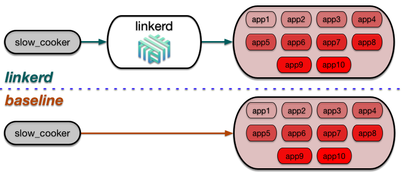
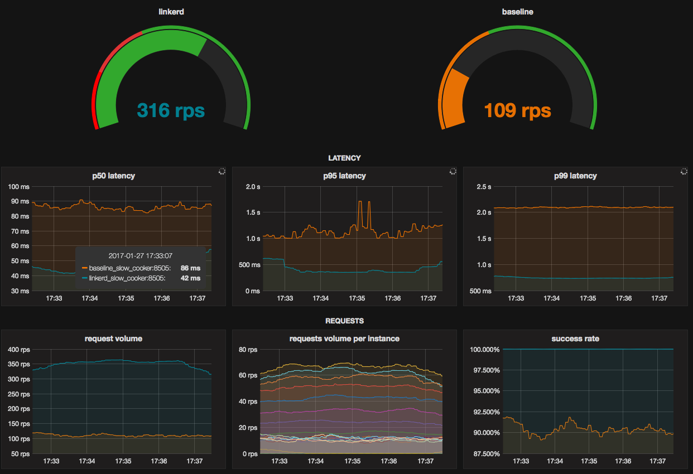

# Go faster by adding more steps

This directory contains a docker-compose environment that runs a demo that you
can use to test linkerd's performance. The results of the demo are discussed in
much more detail in Buoyant's blog post,
[Making Things Faster by Adding More Steps](https://blog.buoyant.io/2017/01/31/making-things-faster-by-adding-more-steps/).

## Startup

The [`docker-compose.yml`](docker-compose.yml) file that's included in this
directory is configured to run the demo. Start all of the containers with:

```bash
docker-compose build && docker-compose up -d
open http://$(docker-machine ip default):3000 # or equivalent docker ip address
```

That command will build and run all of the following containers:



* **2 slow_cookers**: Traffic is generated using [slow\_cooker](
https://github.com/BuoyantIO/slow_cooker). The slow\_cookers are configured to
send 500 requests per second to both the linkerd cluster and the baseline
cluster.

* **linkerd**: linkerd is configured via the provided [`linkerd.yml`](
linkerd.yml), which specifies a router running on port 4140, configured to route
traffic to a backend app cluster, via file-system based service discovery.

* **2 backend clusters**: Each cluster runs 10 instances of the go web server
that's defined in [`server.go`](server.go). One cluster is fronted by linkerd,
another baseline cluster simply uses a Docker network DNS alias. Instance
response times vary between 0 and 2 seconds. The slowest instances also simulate
a decrease in success rate.

* **prometheus**: linkerd, slow\_cooker, and the backend instances expose
metrics data in a format that can be read by
[Prometheus](https://prometheus.io/). Prometheus metrics collection is
configured in [`prometheus.yml`](prometheus.yml), which scrapes all metrics from
all processes every 5 seconds.

* **grafana**: Collected metrics are displayed on a dashboard using [Grafana](
http://grafana.org/). The grafana container is preconfigured to display
dashboard comparing linkerd and the baseline cluster, defined at
[`grafana.json`](grafana.json).

## Dashboards

### Grafana

Grafana is running on port 3000 in your docker-compose environment. To see a
dashboard comparing linkerd with the baseline cluster, load the Grafana
dashboard by going to port 3000 on your docker host. It should look like this:



### Prometheus

Prometheus is running on port 9090 in your docker-compose environment. To see
raw metrics from all processes, go to port 9090 on your docker host.

### linkerd admin

The linkerd admin server is running on port 9990 in your docker-compose
environment. To see the admin dashboard, go to port 9990 on your docker host.

## Troubleshooting

If you have any issues getting the demo up and running, pop into [linkerd's
Slack]( https://slack.linkerd.io) and we'll help you get it sorted out.

Thanks! 👋
