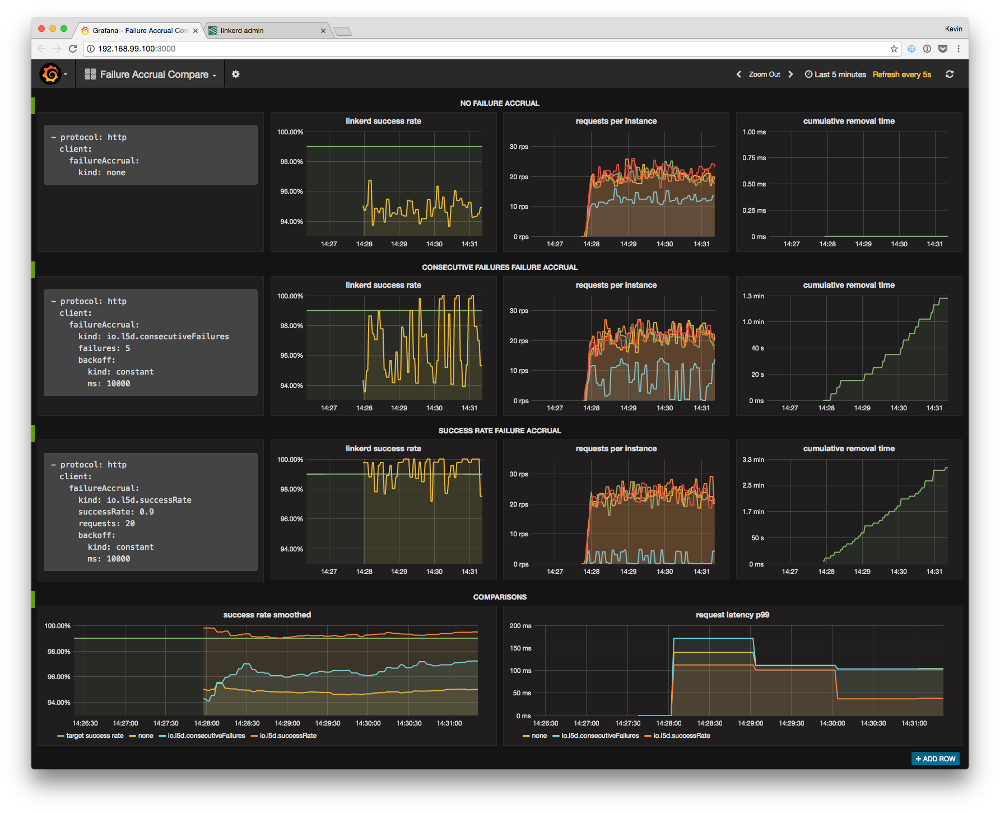
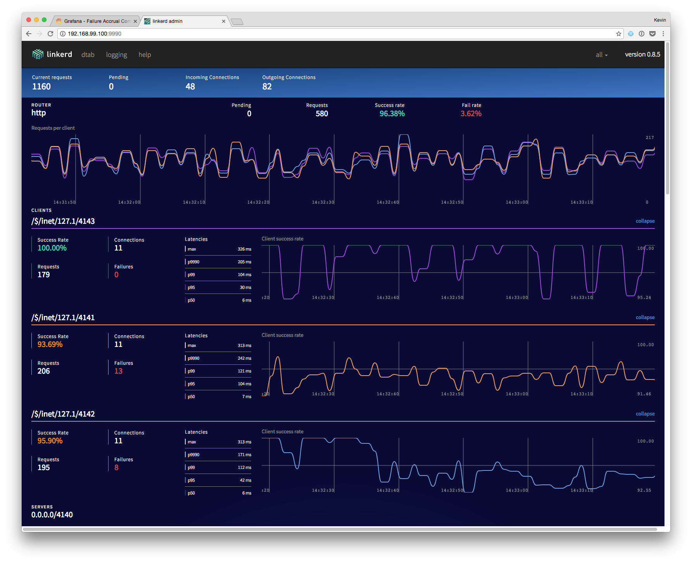

# Failure accrual

This directory contains a docker-compose environment that runs a demo that you
can use to test [linkerd's failure accrual settings](
https://linkerd.io/features/circuit-breaking/#failure-accrual). The results of
the demo are discussed in much more detail in Buoyant's blog post, [Making
microservices more resilient with advanced circuit breaking](
https://blog.buoyant.io/2017/01/13/making-microservices-more-resilient-with-circuit-breaking/).

## Startup

The [`docker-compose.yml`](docker-compose.yml) file that's included in this
directory is configured to run the demo. Start all of the containers with:

```bash
$ docker-compose build && docker-compose up -d
```

That command will build and run all of the following containers:

* **linkerd**: linkerd is configured via the provided [`linkerd.yml`](
linkerd.yml), which specifies 3 separate routers, running on ports 4141, 4142,
and 4143, each configured with different failure accrual policies, and each
routing traffic to separate backend clusters. The linkerd config also specifies
a 4th router running on port 4140, which evenly distributes its requests over
the other three routers, which is useful for traffic generation.

* **3 backend clusters**: Each cluster runs 5 instances of the go web server
that's defined in [`server.go`](server.go). 4 of the 5 instances in each cluster
return responses immediately with 100% success rate. 1 instance simulates a 60%
success rate, and adds 100 milliseconds of latency to failing requests.

* **slow_cooker**: Traffic to linkerd is generated using [slow\_cooker](
https://github.com/BuoyantIO/slow_cooker). slow\_cooker is configured to send
300 requests per second to the linkerd router that is running on port 4140,
which evenly distributes the requests to the other 3 routers, such that each
router receives roughly 100 requests per second.

* **prometheus**: linkerd and the backend instances expose metrics data in a
format that can be read by [Prometheus](https://prometheus.io/). Prometheus
metrics collection is configured in [`prometheus.yml`](prometheus.yml), which
scrapes all metrics from all processes every 5 seconds.

* **grafana**: Collected metrics are displayed on a dashboard using [Grafana](
http://grafana.org/). The grafana container is preconfigured with the failure
accrual comparison dashboard that is defined in [`grafana.json`](grafana.json).

## Dashboards

### Grafana

Grafana is running on port 3000 in your docker-compose environment. To see a
dashboard comparing the different failure accrual settings, load the Grafana
dashboard by going to port 3000 on your docker host. It should look like this:



### linkerd admin

The linkerd admin server is running on port 9990 in your docker-compose
environment. To see the admin dashboard, go to port 9990 on your docker host. It
should look like this:



## Troubleshooting

If you have any issues getting the demo up and running, pop into [linkerd's
Slack]( https://slack.linkerd.io) and we'll help you get it sorted out.

Thanks! 👋
